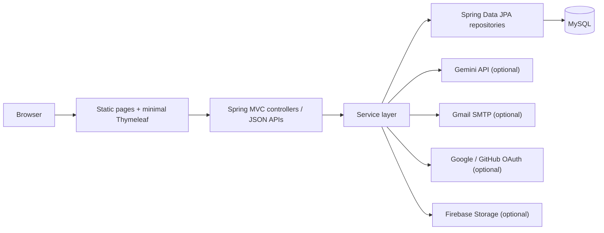

<div align="center">

# Job Management System

An end-to-end recruitment platform built with Spring Boot, MySQL, and server-hosted web pages for candidates, employers, and admins.

It combines classic job board workflows with AI-assisted CV generation, CV scoring, job matching, mock interviews, and content modules such as career guides and career paths.

[](#quick-start)
[](./pom.xml)
[](#license)
[](https://openjdk.org/projects/jdk/17/)
[](https://spring.io/projects/spring-boot)
[](https://www.mysql.com/)

</div>

> Local packaging was verified on April 4, 2026 with `mvnw.cmd -q -DskipTests package`.

## Table of Contents

- [Why This Project](#why-this-project)
- [Feature Overview](#feature-overview)
- [Tech Stack](#tech-stack)
- [Quick Start](#quick-start)
- [Production Deployment](#production-deployment)
- [Configuration](#configuration)
- [Main Workflows](#main-workflows)
- [Architecture](#architecture)
- [Project Structure](#project-structure)
- [Seed Data](#seed-data)
- [Troubleshooting](#troubleshooting)
- [FAQ](#faq)
- [License](#license)

## Why This Project

This repository is a Spring Boot monolith for job discovery, employer hiring workflows, and AI-assisted career tooling.

What is already implemented in code today:

- Candidate registration, login, profile management, saved jobs, and application tracking
- Employer onboarding, OTP-based employer login, company profile management, and job posting
- Admin moderation for jobs, users, employers, analytics, and content modules
- AI-assisted CV generation, CV scoring, CV-vs-JD comparison, job recommendations, and mock interviews
- Public-facing content APIs for hero banners, announcements, career guides, and career paths
- A contact widget chatbot plus scheduled cleanup for stale chat sessions

## Feature Overview

| Area | What ships in the codebase |
| --- | --- |
| Candidate | Browse jobs, save jobs, apply to jobs, manage profile, upload/save CVs, version CVs, view notifications, track application history |
| Employer | Two-step registration, OTP login, manage employer profile, upload employer logo, create/edit/delete job posts, review applicants |
| Admin | Dashboard stats, analytics, user management, employer management, job approval/rejection, application review |
| CV Tooling | AI CV builder, AI CV editing, CV translation, saved CV history, template versioning, uploaded PDF/DOC/DOCX CV support |
| AI Screening | CV scoring, scoring history, CV-to-job matching, CV-to-JD comparison, applicant analysis with compatibility summaries |
| Interview | AI mock interview sessions, interview result scoring, interview history, role/level/type reference data, question bank |
| Content | Career guide, career path APIs, site announcements, hero banners, top employer logos, notification templates |

## Tech Stack

| Layer | Technology |
| --- | --- |
| Backend | Spring Boot 4.1.0-M1 |
| Language | Java 17 |
| Persistence | Spring Data JPA, Hibernate |
| Database | MySQL 8.0 |
| Security | Spring Security, OAuth2 client |
| UI delivery | Static HTML/CSS/JS under `src/main/resources/static`, plus a small Thymeleaf layer |
| Build | Maven Wrapper |
| Containers | Docker, Docker Compose |
| Optional integrations | Gemini API, Gmail SMTP, Google OAuth, GitHub OAuth, Firebase Storage |

## Quick Start

### Prerequisites

- Java 17
- Docker and Docker Compose
- Internet access for Maven dependency resolution on a fresh machine

### Option A: Local development (recommended)

Start only MySQL and phpMyAdmin:

```bash
docker compose up -d mysql phpmyadmin
```

Run the Spring Boot app locally:

```bash
# macOS / Linux
./mvnw spring-boot:run

# Windows
mvnw.cmd spring-boot:run
```

Open the app:

- Application: [http://localhost:8083](http://localhost:8083)
- phpMyAdmin: [http://localhost:8086](http://localhost:8086)
- MySQL host port: `localhost:8085`

### Option B: Full Docker stack

If you want the application itself to run in Docker too:

```bash
docker compose up --build
```

Important:

- `docker compose up` starts the `app` service on port `8083`
- Do not run `mvnw spring-boot:run` at the same time, or you will get a port conflict

### Default development credentials

The application seeds a default admin account on startup:

- Admin: `admin@careerviet.vn` / `admin123`

The codebase also seeds demo candidate and employer accounts in `MasterDataSeeder`.

Example:

- Candidate: `candidate1@gmail.com` / `123456`
- Employer: `employer1@fpt.vn` / `123456`

Note: employer login is OTP-gated, so employer sign-in still needs working email delivery.

## Production Deployment

The repository includes a Docker-based VPS deployment flow with:

- `docker-compose.yml`
- `.env.example`
- `deploy.sh`
- `nginx/default.conf`

The step-by-step guide lives in [docs/DEPLOY_VPS.md](./docs/DEPLOY_VPS.md).

If you already keep secrets in `application-local.properties`, place that file on the VPS at `config/application-local.properties` so Docker can mount it at runtime.

## Configuration

The project already ships with a working local datasource configuration for Docker MySQL:

```properties
spring.datasource.url=jdbc:mysql://localhost:8085/qltd_db?useSSL=false&serverTimezone=Asia/Ho_Chi_Minh&allowPublicKeyRetrieval=true
spring.datasource.username=qltd_user
spring.datasource.password=qltd_pass123
```

Local overrides are imported from the gitignored file:

```text
src/main/resources/application-local.properties
```

Use it for secrets that should not live in Git.

### Optional integration settings

| Setting | Enables | If missing |
| --- | --- | --- |
| `GMAIL_USERNAME`, `GMAIL_APP_PASSWORD` | OTP email delivery, password reset, employer OTP login, OAuth2 OTP completion | OTP-based flows will not be usable end-to-end |
| `GOOGLE_CLIENT_ID`, `GOOGLE_CLIENT_SECRET` | Google OAuth login | Google login disabled |
| `GITHUB_CLIENT_ID`, `GITHUB_CLIENT_SECRET` | GitHub OAuth login | GitHub login disabled |
| `GEMINI_API_KEY` | CV AI, CV scoring, job matching, JD comparison, interview AI, contact chatbot | AI endpoints will fail |
| `CLAUDE_API_KEY` | `ClaudeChatbotService` only | That service remains unusable |
| `firebase.storage.enabled`, `firebase.storage.bucket`, `firebase.storage.service-account-path` | Remote image upload and image serving | Image upload endpoints return configuration errors |

### Example `application-local.properties`

```properties
# Email / OTP
spring.mail.username=your-email@gmail.com
spring.mail.password=your-gmail-app-password

# OAuth
spring.security.oauth2.client.registration.google.client-id=...
spring.security.oauth2.client.registration.google.client-secret=...
spring.security.oauth2.client.registration.github.client-id=...
spring.security.oauth2.client.registration.github.client-secret=...

# AI
gemini.api.key=...
claude.api.key=...

# Firebase image storage
firebase.storage.enabled=true
firebase.storage.bucket=your-project.firebasestorage.app
firebase.storage.service-account-path=file:/absolute/path/to/serviceAccountKey.json
```

## Main Workflows

### Candidate flow

1. Browse public pages such as job search, career guide, career paths, CV tools, and interview pages.
2. Register as a candidate via `/api/auth/register/user`.
3. Verify email OTP through `/api/2fa/verify-email`.
4. Create or upload CVs through `/api/user-cv/**`.
5. Optionally use AI features:
   - CV generation and editing: `/api/cv-ai/**`
   - CV scoring and match jobs: `/api/cv-scoring/**`
   - Mock interview: `/api/interview/**`
6. Apply to jobs via `/api/applications/apply`.
7. Track saved jobs, notifications, and personal application history.

### Employer flow

1. Register employer account in two steps:
   - Step 1 creates the auth record and sends OTP
   - Step 2 stores company profile data
2. Login as employer, then complete OTP verification before the session is fully established.
3. Manage employer profile and logo.
4. Create job posts through `/api/jobs/create`.
5. Newly created jobs are stored as `PENDING`.
6. An admin approves the job, changing it to `ACTIVE`.
7. Employer reviews applicants, runs AI applicant analysis, and updates application status.
8. When a candidate is moved to `INTERVIEW`, a notification is created for that candidate.

### Admin flow

1. Login with the seeded admin account.
2. Monitor dashboard stats and 30-day analytics.
3. Manage users, employers, jobs, and applications.
4. Approve, reject, pause, or reactivate jobs.
5. Manage CV templates, hero banners, top employer logos, announcements, and career-guide content.

### AI-assisted flow

The current active AI path in controllers routes through `GeminiService`:

- AI CV builder and editor
- CV scoring from uploaded files or saved CV JSON
- CV-to-job recommendation
- CV-to-JD comparison
- Applicant summary and compatibility scoring
- Mock interview chat and interview evaluation
- Contact widget chatbot

## Architecture

### Runtime view



### Code-level architecture

- `config/`
  Contains security, MVC resource handling, Firebase wiring, schedulers, and startup seeders.
- `controller/`
  Handles public APIs, admin APIs, auth flows, job flows, CV flows, interview flows, uploads, and content APIs.
- `service/`
  Contains business logic, AI orchestration, OTP/email handling, versioning, and chat/session behavior.
- `repository/`
  Spring Data JPA repositories for every major aggregate.
- `entity/`
  Covers users, employers, jobs, applications, CVs, interviews, notifications, chat sessions, content modules, and lookup tables.
- `static/`
  Main UI delivery mechanism. Most pages are static HTML/CSS/JS that call backend JSON APIs.
- `templates/`
  Very small Thymeleaf footprint; `403.html` is the main visible template.

### Architectural observations from the codebase

- This is a monolith, not a microservice system.
- The frontend is closer to a server-hosted static app than a full Thymeleaf MVC application.
- Startup seeders do a lot of work:
  - roles and default admin
  - option tables and filters
  - demo users, employers, jobs, and applications
  - CV templates and version metadata
  - interview roles, levels, types, prompts, and question bank
  - notification templates, hero banners, and top employer logos
- Chat session cleanup is scheduled hourly and once shortly after startup.
- Current defaults are clearly development-oriented:
  - `spring.jpa.hibernate.ddl-auto=update`
  - demo data seeded automatically
  - CSRF disabled
  - permissive request access for many routes

## Project Structure

```text
job-management-system/
├── src/
│   ├── main/
│   │   ├── java/Nhom08/Project/
│   │   │   ├── config/
│   │   │   ├── controller/
│   │   │   ├── dto/
│   │   │   ├── entity/
│   │   │   ├── handler/
│   │   │   ├── repository/
│   │   │   ├── security/
│   │   │   ├── service/
│   │   │   └── QltdApplication.java
│   │   └── resources/
│   │       ├── db/
│   │       ├── static/
│   │       ├── templates/
│   │       └── application.properties
│   └── test/
│       └── java/Nhom08/Project/QltdApplicationTests.java
├── init-scripts/
├── uploads/
├── docker-compose.yml
├── Dockerfile
├── pom.xml
└── README.md
```

## Seed Data

On startup, the application bootstraps a large amount of demo and reference data.

Seed categories include:

- Roles and the default admin account
- Industries, provinces, education levels, degree levels, experience levels, job benefits, and dynamic filter options
- Demo employers, candidate accounts, jobs, job applications, and job statistics
- CV scoring criteria
- CV templates and their version histories
- Interview levels, types, roles, prompt templates, and question bank entries
- Hero banners, top employer logos, and notification templates

This makes the repository useful for demos and local exploration right after first boot.

## Troubleshooting

### Port `8083` is already in use

You probably started the Docker `app` service and then also tried to run Spring Boot locally.

Fix:

- Use `docker compose up -d mysql phpmyadmin` for local development
- Or stop the Docker app container before running `mvnw spring-boot:run`

### Cannot connect to MySQL

The host port is `8085`, not the default MySQL port `3306`.

Check:

- `docker compose ps`
- the datasource URL in `application.properties`
- whether `mysql` is healthy before starting the application

### OTP emails are not arriving

OTP is required for:

- candidate email verification
- employer registration verification
- employer login
- password reset
- OAuth2 login completion

Check:

- `spring.mail.username`
- `spring.mail.password`
- whether you are using a Gmail App Password instead of the regular account password

### AI endpoints return `500`

Most AI features depend on `gemini.api.key`.

Affected areas:

- CV generation and editing
- CV scoring
- job recommendation from CV
- CV-vs-JD comparison
- interview AI
- contact chatbot

### Employer logo or image upload returns `503`

Firebase Storage is optional, but image upload endpoints depend on it when invoked.

Check:

- `firebase.storage.enabled=true`
- `firebase.storage.bucket`
- `firebase.storage.service-account-path`

### The app starts but some features still feel unavailable

That is expected when optional integrations are not configured.

Without SMTP, OTP flows break.
Without Gemini, AI flows break.
Without Firebase, image upload breaks.
Without OAuth credentials, social login breaks.

## FAQ

### Can I run the project without AI keys?

Yes, but only the non-AI parts of the platform will work reliably. Public browsing, core CRUD, admin dashboards, and seeded demo data are still useful. AI CV features, interview AI, and chatbot features require `GEMINI_API_KEY`.

### Why is MySQL exposed on port `8085`?

Because `docker-compose.yml` maps host port `8085` to container port `3306`.

### Is employer login different from candidate login?

Yes. Employer login is OTP-gated on top of password authentication. Candidate and admin password login do not go through the same OTP login step.

### Why does the license badge say "not specified"?

Because the repository currently does not include a committed `LICENSE` file, and the Maven metadata does not declare a concrete license either.

### Is this production-ready as-is?

Not yet. The repository is strong as a development/demo foundation, but production hardening is still needed around security, secret management, deployment strategy, data seeding, and operational defaults.

Examples of code-level reasons:

- CSRF is disabled
- `ddl-auto=update` is enabled
- demo users and data are auto-seeded
- several features rely on local/dev-friendly defaults

## License

No open-source license file is currently included in this repository.

If you plan to publish or redistribute this project, add a `LICENSE` file before treating it as an open-source package.
